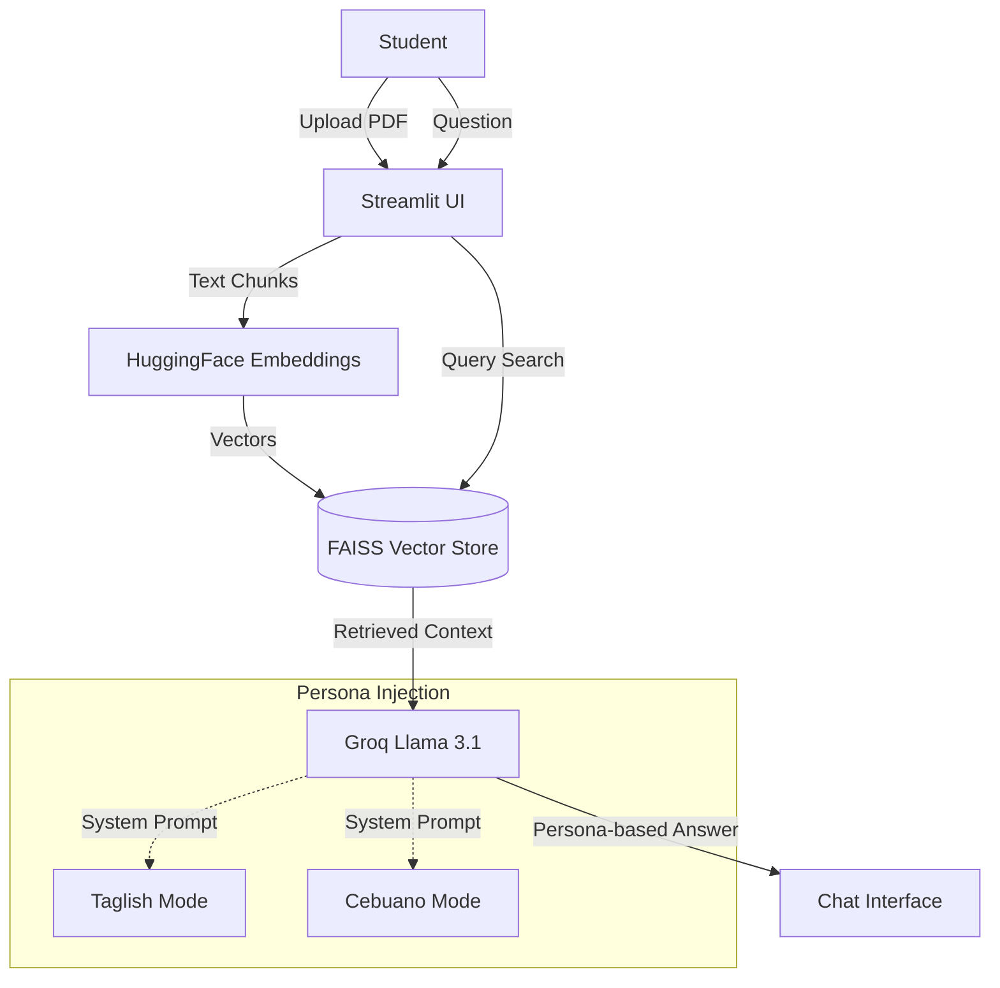

# Aral-AI: Your Smart Filipino Tutor

> A localized RAG-powered study companion that transforms static PDF modules into interactive, persona-based tutoring sessions using Llama 3 and LangChain.


## 📖 Overview

Aral-AI tackles the problem of information overload in student modules. Instead of CTRL+F searching through massive PDFs, students can chat with their materials.

Uniquely, Aral-AI features **Cultural Localization**. It doesn't just answer; it adopts the persona of a friendly Filipino tutor, capable of explaining complex academic concepts in Taglish, Cebuano (Bisaya), or Formal English. It leverages Groq's high-speed inference to provide near-instant feedback.

## 🏗️ Architecture

The system implements a local Retrieval-Augmented Generation (RAG) pipeline:


## ⚡ Tech Stack
**Frontend & Interface**
- Streamlit: Rapid UI development for file uploads and chat interface.
- Terminal Mode: Fallback CLI for headless testing.

**AI & Data Pipeline**
- LLM Engine: Groq API (Llama 3.1-8b-instant) for ultra-low latency responses.
- Orchestration: LangChain (RetrievalQA Chains, PromptTemplates).
- Embeddings: sentence-transformers/all-MiniLM-L6-v2 (Running locally on CPU).
- Vector Store: FAISS (Facebook AI Similarity Search) for efficient local similarity search.
- Document Processing: PyPDFLoader & RecursiveCharacterTextSplitter.

## 🚀 Features
- **Context-Aware Answers:** Retrieves specific information strictly from the uploaded module to prevent hallucinations.
- **Dynamic Personas:**
  - 🇵🇭 **Taglish (Default):** Friendly, "Explain Like I'm 5" tone.
  - 🏝️ **Cebuano (Bisaya)**: Localized dialect support for Visayas/Mindanao students.
  - 🎓 **Formal English:** Standard academic tone.
- **Hybrid Deployment:** Runs as a Web App (app_ui.py) or a lightweight Terminal App (app_terminal.py).
- **Memory Efficient:** Uses tempfile processing to handle uploads without cluttering local storage.

## 🛠️ Getting Started
**Prerequisites**
- Python 3.9+
- A Groq API Key

**1. Installation**
```sh
git clone https://github.com/your-username/aral-ai.git
cd aral-ai
python -m venv venv
source venv/bin/activate  # Windows: venv\Scripts\activate
pip install -r requirements.txt
```

**2. Environment Setup**
Create `.env` file in the root directory:
```ssh
GROQ_API_KEY=gsk_your_actual_api_key_here
```

**3. Running the applcication**
**Option A: Web UI (Recommended)**
```ssh
streamlit run app_ui.py
```
_Access the app at http://localhost:8501_
**Option B: Terminal Mode First, process your PDF (place it in data/sample_module.pdf)**
```ssh
python create_db.py
```
Then run the chat:
```ssh
python app_terminal.py
```

## 🔮 Roadmap
- [x] Phase 1: Core RAG Pipeline (PDF to FAISS)
- [x] Phase 2: Multi-Persona Support (Taglish/Bisaya)
- [x] Phase 3: Streamlit UI Implementation
- [ ] Phase 4: Chat History Persistence (Session State optimization)
- [ ] Phase 5: Support for Multiple Files/formats (Docx, PPT)

## 🤝 Contributing
1. Fork the Project
2. Create your Feature Branch (git checkout -b feat/NewPersona)
3. Commit your Changes (git commit -m 'feat: Add Ilocano support')
4. Push to the Branch (git push origin feat/NewPersona)
5. Open a Pull Request
